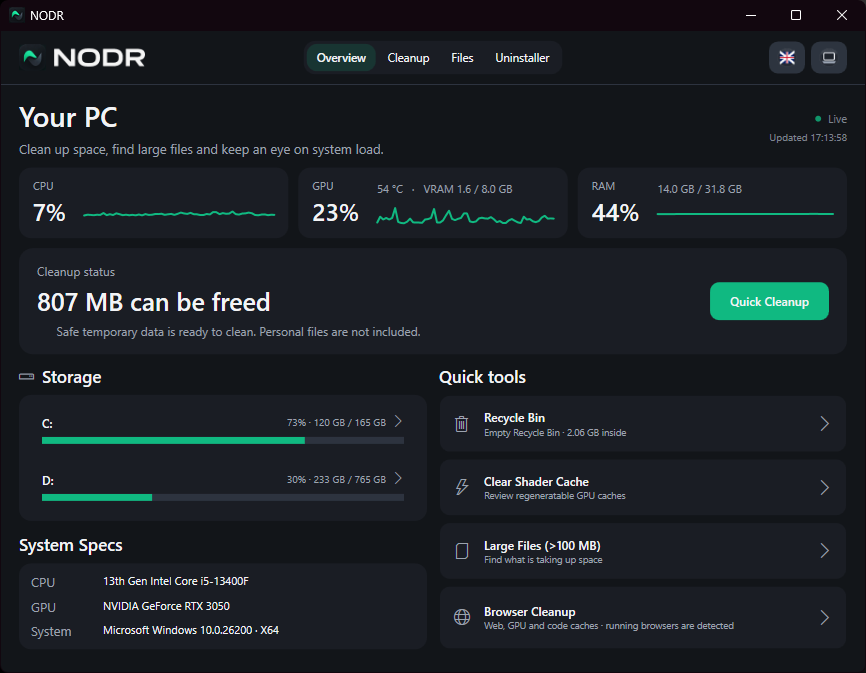
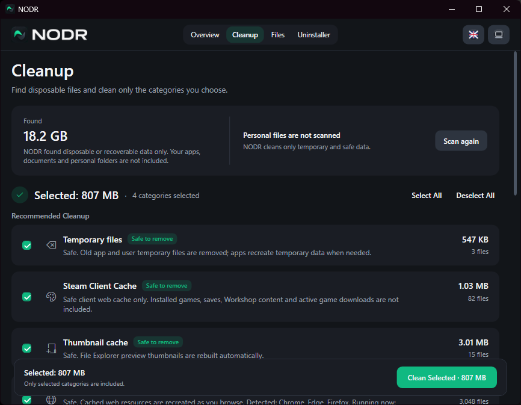
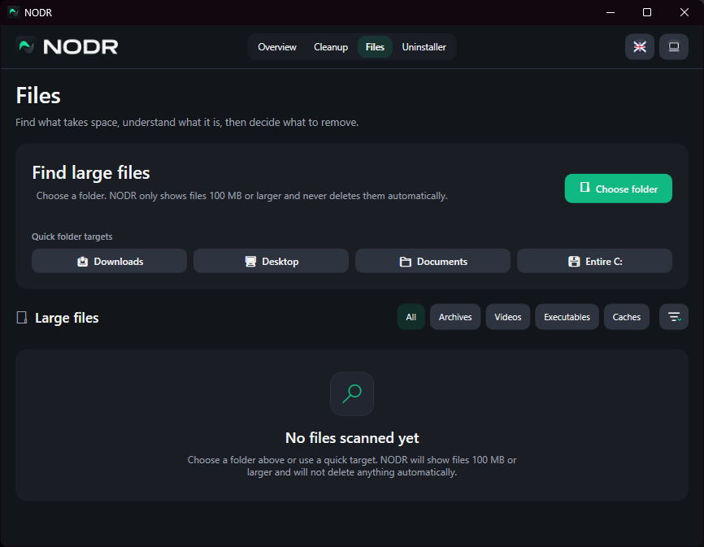
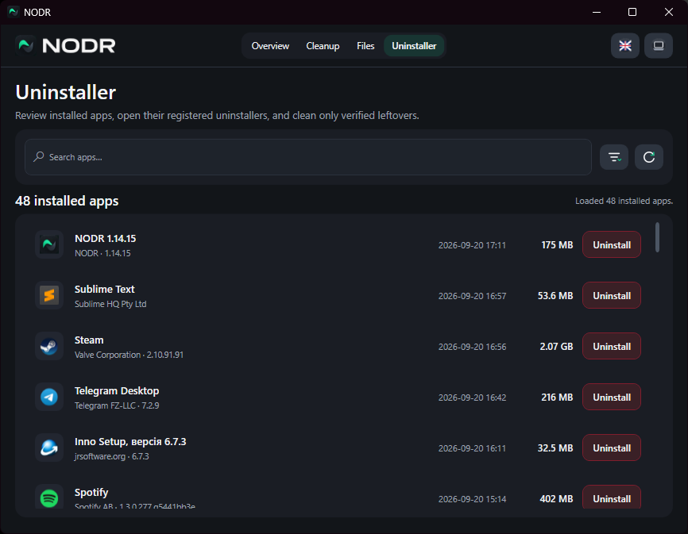
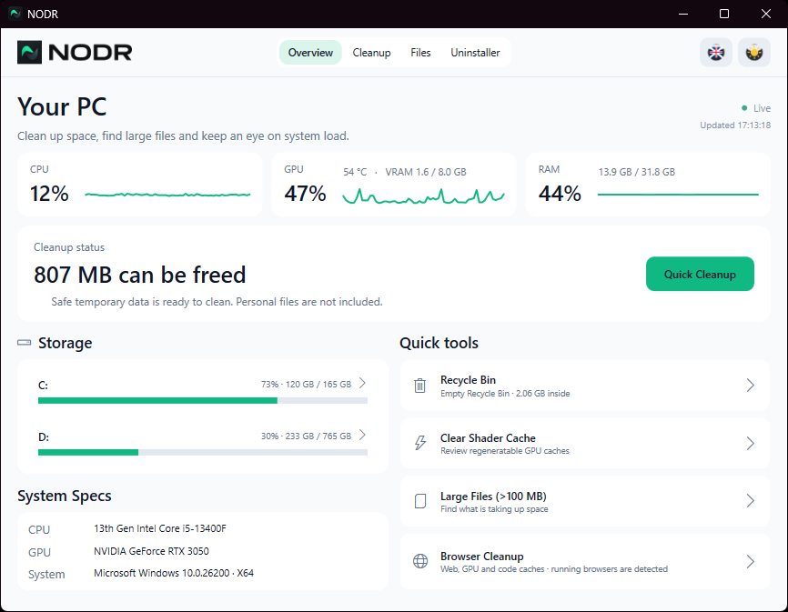

# NODR

**Cleaner. Faster. Freer.**

NODR is a focused Windows utility for system monitoring, safe disk cleanup, large-file discovery, and controlled application removal — without “magic optimizer” features.

> **Local-first. Transparent. Conservative by design.**

<p align="center">
  
</p>

## Features

### System Overview

Monitor CPU, GPU, RAM, and storage usage at a glance, review system information, and access common maintenance tools.

### Targeted Cleanup

Scan disposable or recoverable data and choose exactly which categories to clean. Personal files are not included in cleanup scans.

<p align="center">
  
</p>

### Large File Finder

Find files **100 MB or larger**, understand what is consuming disk space, and decide what to remove. NODR never automatically deletes files found by the scanner.

<p align="center">
  
</p>

### App Uninstaller

Review installed applications, launch their registered uninstallers, and inspect narrowly attributable leftovers after uninstall.

<p align="center">
  
</p>

## Safety & Privacy

NODR is deliberately conservative:

- **No registry cleaner, RAM cleaner, or Prefetch cleaner**
- **No automatic deletion of personal files**
- User-file deletion uses the **Windows Recycle Bin** where applicable
- Reparse points, junctions, and symbolic links are not followed during file scans
- Cleanup categories clearly show what is selected before cleaning
- File safety and residual classification use deterministic local rules

## Themes & Languages

NODR supports **System, Dark, and Light** themes.

<p align="center">
  
</p>

Available languages:

- English (default)
- Ukrainian
- Russian

## Download

Download the latest version from [**Releases**](../../releases).

Two Windows x64 distributions are provided:

- **Setup** — standard Windows installer
- **Portable** — self-contained ZIP; extract it and run `NODR.exe`

### Requirements

- Windows 10 / 11 x64
- No separate .NET installation required for release builds

## Building from Source

### Prerequisites

- [.NET 10 SDK](https://dotnet.microsoft.com/download/dotnet/10.0)
- [Inno Setup 6](https://jrsoftware.org/isinfo.php) *(optional; required only for building Setup)*

Clone the repository:

```bash
git clone https://github.com/nthngreal/NODR.git
cd NODR
```

Run NODR:

```bat
run.bat
```

Build release packages:

```bat
build-release.bat
```

The release builder creates a self-contained Windows x64 build and Portable ZIP. If Inno Setup is installed, it also creates the Setup executable.

## Third-Party Software

NODR uses [LibreHardwareMonitor](https://github.com/LibreHardwareMonitor/LibreHardwareMonitor) for hardware sensor access.

See [THIRD_PARTY_NOTICES.md](THIRD_PARTY_NOTICES.md) for licensing and attribution information.

## Current Release

**v1.14.15**

Available as both Setup and Portable Windows x64 builds.

---

Made with a preference for useful tools over feature bloat.